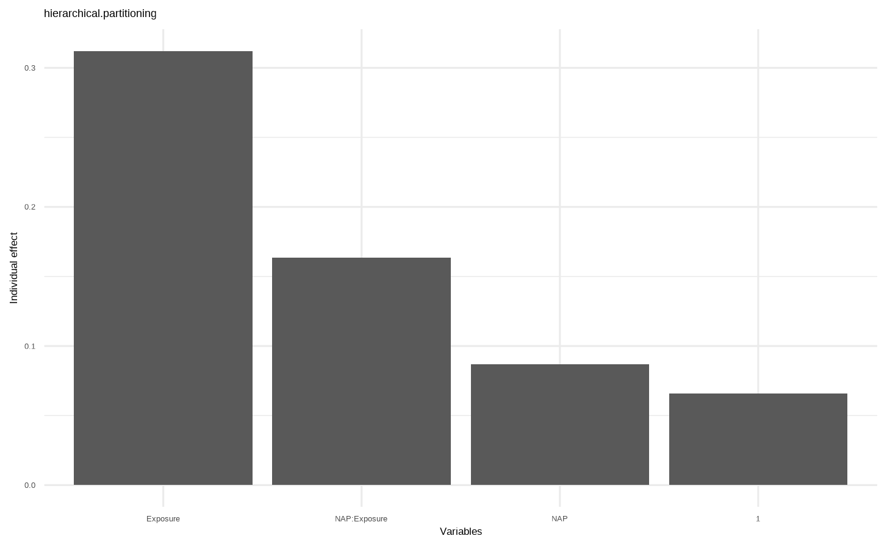

# 线性混合效应模型

线性混合效应模型 （Linear Mixed-effect Model，LMM），研究资料通常需要满足三个基本条件：①给定解释变量的条件下，响应变量为服从正态分布的定量变量；②解释变量和响应变量呈线性关系；③给定解释 变量的条件下，个体（类）内响应变量不独立，呈某种相关（或方差协方差）结构

<https://m-clark.github.io/mixed-models-with-R/>

[Mixed Effects Models and Extensions in Ecology with R 第5章](https://link.springer.com/book/10.1007/978-0-387-87458-6)

## 一般线性混合效应模型

线性混合模型的一般表达形式：

$$ Y = \mathbf{X} \beta + \mathbf{Z} \gamma + \epsilon $$

其中：

-   $\mathbf{X}\beta$ 同一般线性模型，称为固定效应（fixed effect）部分；其中 X 为解释变量的设计矩阵，可包含定性变量和定量变量，也可包含变量间的交互效应项或二次项等； β 为固定效应参数向量，反映 Ｘ 对响应变量 Ｙ 的影响大小。固定效应是感兴趣的自变量，表示所有个体都相同的效应

-   $\mathbf{Z}\gamma$ 为随机效应（random effect）部分， Ｚ 为随机效应的设计矩阵， γ 为相应的随机效应参数向量。随机效应：随机截距表示不同个体的基线差异，随机斜率表示不同个体对自变量的响应差异。随机效应参数向量 γ 服从多元正态分布，均向量为０，方差协方差矩阵为 Ｇ，并假设 Ｇ 可满足任意的协方差结构。

-   响应变量 Ｙ 服从多元正态分布，均向量为 Ｅ（Ｙ） ＝ ｘβ ，方差协方差阵为 Var(Ｙ) ＝ ＺＧＺ′ ＋ Ｒ。当 Ｒ ＝ σ２Ｉ 且 Ｚ ＝ ０ 时，线性混合效应模型则退化为普通的一 般线性模型。

-   $\epsilon$ 是误差项。

## 常见的协方差结构

[高级医学统计学 第13章 线性混合效应模型](https://book.sciencereading.cn/shop/book/Booksimple/onlineRead.do?id=B17792CBC7A4D446CA15AC0E4D33C445F000&bookPageNum=273)

1.  球性结构（sphericity structure）：即矩阵主对角线元素为效应的方差 σ２， 非对角线元素为 ０

2.  方差分量结构（variance components structure，VC）

3.  复合对称结构（compound symmetry structure，CS）

4.  无结构（unstructured structure）

5.  一阶自回归结构【first-order autoregressive structure, AR(1)】

6.  Toeplitz 结构(TOEP)

## 重复测量混合模型

对于连续数据，mixed model repeated measures（MMRM）

对于重复测量资料，令 $Ｙ_i＝ （Ｙ_{i1}，…，Ｙ_{it{_i}}）′$ 表示第 $ｉ（ｉ ＝ １，２，…，ｎ）$个个 体的 $t_i$ 次响应向量。对重复测量数据一般的线性混合模型可以表示为

$$
Ｙ_i＝ X_iβ ＋ Ｚ_iγ_i＋ ε_i
$$

ｘｉ 是第 ｉ 个个体的 ｔｉ × ｐ 维模型设计矩阵， β 是 ｐ × １ 维的回归系数向量， Ｚｉ 是 ｔｉ × ｑ 维随机效应的设计矩阵， γｉ 是第 ｉ 个个体的 ｑ × １ 维随机效应向量，且 εｉ 是 ｔｉ × １ 维个体内误 差向量

对于分类数据或计数数据，generalized linear mixed-effects model(GLMM)

## `lme4::lmer()`

`lmer()` 的表达式如下：

$$
lmer (data,formual= DV \sim Fixed\_Factor + \\ (Random\_intercept + Random\_slope | Random\_Factor)+\\(Random\_intercept + Random\_slope | Random\_Factor)+...
\\)
$$

截距中，1表示随机截距，0表示固定截距，默认截距为1。

| LME                         | 表达式             | 简写             |
|-----------------------------|--------------------|------------------|
| 随机截距+随机斜率           | y\~x+( 1+x \| id ) | y\~x+( x \| id ) |
| 随机截距+固定斜率           | y\~x+( 1+1 \| id ) | y\~x+( 1 \| id ) |
| 固定截距+随机斜率           | y\~x+( 0+x \| id ) | NA               |
| 线性模型：固定截距+固定斜率 | y\~x               | NA               |

```{r}
library(readr)
library(dplyr)

rikz <- read_tsv("data/AED/RIKZ.txt")
rikz <- rikz |> 
    mutate(
        Beach = factor(Beach),
        Exposure = factor(Exposure)
    )
head(rikz)
```

## 随机截距+随机斜率

$$
\eta_{(nrow \times 1)} = \mathbf{X}_{nrow \times 1} \beta_{1 \times 1} + \mathbf{Z}_{nrow \times 2n_{subjects}} \mathbf{\gamma}_{2n_{subjects} \times 1} + \epsilon_i
$$

Z有两倍于受试者数量的列，每个受试者的随机截距和随机斜率

```{r}
library(lmerTest)
conflicted::conflicts_prefer(lmerTest::lmer)
lme1 <- lmer(Richness ~ 1 + NAP + Exposure+ NAP:Exposure + (1 + NAP |Beach) ,data = rikz)
summary(lme1)


plot(lme1)

AIC(lme1)
BIC(lme1)
logLik(lme1)

# library(broom.mixed)
# tidy(lme1)


library(nlme)
lme(Richness ~ 1 + NAP * Exposure,
             random = ~ 1 + NAP | Beach ,
             data = rikz,
             control = lmeControl(opt = "optim", 
                                  msMaxIter = 1000, 
                                  msMaxEval = 5000)
    ) |> 
    summary()
```

这个模型的公式可以分解为：

-   REML 限制性最大似然准则 `207.2`，评估模型的拟合优度

-   `Scaled residuals`

-   **随机效应部分**：`Beach` 作为随机效应的分组变量，包含随机截距和随机斜率（NAP），相关性为 -1，说明随机截距和随机斜率之间呈现完全负相关关系。

-   **固定效应部分**：`Richness` 的预测由截距、NAP（数值变量）和 Exposure（分类变量，包含 Exposure10 和 Exposure11）及其交互项构成。

-   固定效应的相关性矩阵

```{r}
# 标准化模型残差分布
quantile(residuals(lme1,type="pearson",scaled=T))
# 查看固定效应和显著性检验
fixef(lme1)   
anova(lme1)


# 随机效应：随机截距和随机斜率  # 每个组的随机截距表示该组的平均值与模型整体平均值（截距）的差异
ranef(lme1) 
# 随机效应的显著性检验
lmerTest::ranova(lme1)

cor(ranef(lme1)$Beach)


```

```{r eval=FALSE}
e <- glmm.hp::glmm.hp(lme1)
save(e,file = "data/glmm.hp.Rdata")

# $r.squaredGLMM
#            R2m       R2c
# [1,] 0.6279508 0.7811086
# 
# $hierarchical.partitioning
#              Unique Average.share Individual I.perc(%)
# 1            0.0000        0.0657     0.0657     10.46
# NAP          0.0000        0.0867     0.0867     13.81
# Exposure     0.2987        0.0135     0.3122     49.71
# NAP:Exposure 0.0884        0.0750     0.1634     26.02
# 
# $variables
# [1] "1"            "NAP"          "Exposure"     "NAP:Exposure"
# 
# $type
# [1] "hierarchical.partitioning"
# 
# attr(,"class")
# [1] "glmmhp"
```

```{r}
load("data/glmm.hp.Rdata")
e
```

**`$r.squaredGLMM`**

-   这里呈现了两个衡量模型拟合优度的指标，`R2m` 和 `R2c`，分别对应不同的广义决定系数计算方式。

    -   `R2m` 的值为 `0.6279508`，表示固定效应变量解释了大约62.80%的响应变量的方差

    -   `R2c` 的值为 `0.7811086`，表示固定效应和随机效应共同解释了大约78.11%的响应变量的方差

**`$hierarchical.partitioning`**

-   **“Unique” 列**：展示了各变量独自解释的方差比例

-   **“Average.share” 列**：变量与其他变量所有组合的方差解释比例

-   **“Individual” 列**：**“Unique”和“Average.share”的和，即变量的总贡献**

-   **“I.perc (%)” 列**：每个变量的相对重要性程度。

**`$variables`**

-   简单列出了模型中涉及的变量名称，这里有 `"1"`（代表整体截距）、`"NAP"`、`"Exposure"` 以及它们的交互项 `"NAP:Exposure"`，明确了模型在分析中考虑的因素构成。

**`$type`**

-   指出了当前分析结果呈现的类型是 `"hierarchical.partitioning"`，说明后续如果进一步拓展分析或者对比不同模型等操作时，可以清楚知道这部分结果对应的分析类别。

```{r eval=FALSE}
plot(e)
```

{fig-align="center" width="80%"}

## 随机截距+固定斜率

$$
\eta_{(nrow \ \times 1)}=\mathbf{X_{nrow×1}}\beta_{1\times1} +Z_{nrow\times n_{subjects}} \mathbf{\gamma}_{n_{subjects}\times 1}+\epsilon_i
$$

Z有一倍于受试者数量的列，每个受试者的随机截距。

```{r}
lme2 <- lmer(Richness ~ 1 + NAP * Exposure+ (1+1 |Beach) ,data = rikz)
summary(lme2)
AIC(lme2)
BIC(lme2)
logLik(lme2)

2*(1-pt(6.007,35,lower.tail = T))


lme(Richness ~ 1 + NAP * Exposure,random= ~ 1+1 |Beach ,data = rikz) |> 
    summary()
```

## 固定截距+随机斜率

$$
\eta_{(nrow \times 1)} = \mathbf{X}_{nrow \times 1} \beta_{1 \times 1} + \mathbf{Z}_{nrow \times n_{subjects}} \mathbf{\gamma}_{n_{subjects} \times 1} + \epsilon_i
$$

Z 有一倍于受试者数量的列，每个受试者的随机斜率。

```{r}
lme3 <- lmer(Richness ~ 1 +  NAP * Exposure + (0 + NAP |Beach) ,data = rikz)
summary(lme3)


lme(Richness ~ 1 + NAP * Exposure,random= ~ 0+NAP |Beach ,data = rikz) |> 
    summary()

```

## 随机效应模型

```{r}

lme4 <- lmer(Richness ~ 1 + (1+NAP|Beach) ,data = rikz)
summary(lme4)

ranef(lme4)

lme(Richness ~ 1 ,random= ~ 1+NAP |Beach ,data = rikz) |> 
    summary()
```

## 线性模型：固定截距+ 固定斜率

```{r}
lm <- lm(Richness ~ 1 + NAP * Exposure ,data = rikz)
lm
```

## 模型选择

限制最大似然法REML

1.  **赤池信息准则（AIC）**

    $$ kIC=−2log(\mathcal{L})+2k$$

    其中：

    -   $\mathcal{L}$ 是似然函数。

    -   $k$ 是模型参数的数量。

2.  **贝叶斯信息准则（BIC）**

    $$ BIC=−2log(\mathcal{L})+klog(n) $$

    其中：

    -   $n$ 是样本量。

```{r}

plot_lme <- function(model, title) {
    ggplot(rikz, aes(NAP, Richness, group = Beach, color = Beach)) +
        geom_point() +
        geom_line(
            data =  bind_cols(rikz, .pred = predict(model, rikz)),
            mapping = aes(y = .pred),
            linewidth = 1
        ) +
        labs(title = title)+
        scale_x_continuous(expand = (mult=c(0,.1)))+
        scale_y_continuous(expand = (mult=c(0,.1)))+
    ggsci::scale_color_jco() +
        ggpubr::theme_pubr() +
        theme(legend.position = "right",
              plot.title = element_text(hjust = .5))
}

library(purrr)
library(ggplot2)
lme_plot <- map2(list(lme1,lme2,lme3, lme4,lm),list("随机截距+随机斜率","随机截距+固定斜率","固定截距+随机斜率","随机效应","固定效应"),plot_lme)


lme_plot
```

```{r}
anova(lme1,lme2,lme3,lme4,lm)

# p小于0.05,说明全模型与简化后模型存在差异，最终采用lme1,AIC
```

## 模型诊断

sleepstudy

```{r}
# 拟合线性混合模型
model <- lme1
# 1. 残差图
residuals <- resid(model)
fitted <- fitted(model)
ggplot(data.frame(fitted, residuals), aes(fitted, residuals)) +
  geom_point() +
  geom_smooth(method = "loess", se = FALSE) +
  labs(title = "Residuals vs Fitted", x = "Fitted values", y = "Residuals")

# 2. QQ图
qqnorm(residuals)
qqline(residuals)

# 3. Cook's 距离
cooksd <- cooks.distance(model)
plot(cooksd, type = "h", main = "Cook's Distance")

# 4. 随机效应的分布
rand_dist <- ranef(model)

qqnorm(rand_dist$Beach$NAP)
qqline(rand_dist$Beach$NAP)
```
