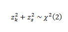
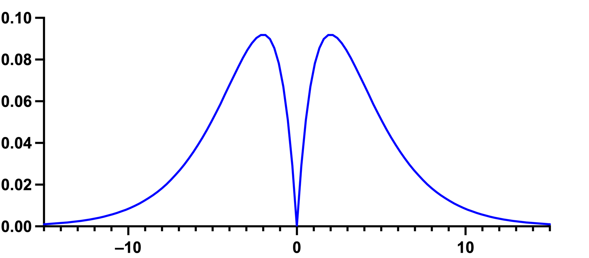

# 正态性检验

<https://www.datanovia.com/en/courses/statistical-tests-and-assumptions/>

<https://real-statistics.com/tests-normality-and-symmetry/>

```{r}
library(tidyverse)
library(ggpubr)
library(rstatix)

df <- c(34,56,39,71,84,92,44,67,98,49,55,73,50,62,75,44,88,53,61,25,36,66,77,35)
```

## 图示法

### 密度图

密度图提供了关于分布是否为钟形的视觉判断

```{r}
ggdensity(df, fill = "lightgray") +
    stat_overlay_normal_density(color = "red", linetype = "dashed")
```

### Q-Q图

Q-Q图（或分位数-分位数图）绘制给定样本与正态分布之间的相关性。还绘制了一条 45 度参考线。在 QQ 图中，每个观测值都绘制为一个点。如果数据是正常的，则点应形成一条直线。

```{r}
ggqqplot(df)
```

## 基于回归和相关

SAS软件规定：当样本含量n≤2000时，结果以SW检验为准，当样本含量n \>2000时，结果以Kolmogorov-Smirnov(D检验)为准。

### Shapiro-Wilk’s test

Shapiro-Wilk检验而是将数据的实际SD与根据数据的QQ图斜率计算的SD进行比较，并计算其比率。如果数据从高斯分布中采样，则两个值将相似，因此比率将接近1.0，而比率与1相差很大则表明为非正态分布。如果每个值均唯一，则Shapiro-Wilk检验非常有效，但如果几个值均相同，则不那么有效。推荐样本量 7\~2000。

这些检验的原假设是“样本分布是正态的”。如果检验显著，则分布为非正态分布。Shapiro-Wilk 方法被广泛推荐用于正态性检验，它提供了比 K-S 更好的功率。 它基于数据与相应的正常分数之间的相关性。

::: callout-note
正态性检验对样本量很敏感。小样本通常通过正态性检验。因此，为了做出正确的决定，将图示法和显著性检验结合起来是很重要的。如果样本数量大于 50，则首选正态 QQ 图，因为在较大的样本量下，Shapiro-Wilk 检验变得非常敏感，即使与正态的微小偏差也是如此。
:::

```{r}
shapiro.test(df)
```

## 基于经验分布函数（empirical distribution function）

### Kolmogorov-Smirnov (K-S) test

Kolmogorov-Smirnov检验（K-S检验），这是一种非参数检验方法，用于比较一个样本的累积分布函数（CDF）与某个理论CDF的差异。需要指定总体的均值和方差

不建议使用Kolmogorov-Smirnov检验。但在大样本（\>2000）实用

```{r}
ks.test(df,"pnorm",mean=mean(df),sd=sd(df))
```

在执行单样本Kolmogorov-Smirnov检验时，数据中不应该存在“ties”，即不应该有重复的数值。如果存在重复的数值，它会影响检验的有效性，因为K-S检验对数据中的“ties”敏感。此时，可以考虑使用其他对“ties”不敏感的检验方法，例如Shapiro-Wilk检验或Lilliefors检验。

### Lilliefors test

**Lilliefors test** 是一个修改版的K-S检验，它使用样本均值和标准差来标准化数据，然后与标准正态分布进行比较

```{r}
nortest::lillie.test(df)
```

### Anderson-Darling test

Anderson-Darling test 是基于累积分布函数（CDF）的比较，通过计算观测值与理论分布之间的差异程度来评估数据的拟合程度。在R语言中，可以使用 `nortest` 包中的 `ad.test()` 函数来执行此检验。此检验的原假设同样是数据服从正态分布，如果p值小于显著性水平，则拒绝原假设，认为数据不服从正态分布。对尾部敏感，适用于中等样本量的数据

```{r}
nortest::ad.test(df)
```

## 基于卡方分布

### D’Agostino-Pearson Omnibus Test

<https://real-statistics.com/tests-normality-and-symmetry/statistical-tests-normality-symmetry/dagostino-pearson-test/>

<https://statskingdom.com/dagostino-pearson-test-calculator.html>

D'Agostino-Pearson 综合检验 是基于数据的偏度和峰度来评估数据是否接近正态分布的。n≥20



首先计算偏斜度和峰度，以量化分布在不对称性和形状方面与高斯分布的差距。然后，其计算这些值中的每一个与高斯分布的预期值之间的差异，并基于这些差异的总和，计算各P值。这是一种通用和强大的正态性检验，通常推荐使用。但值得注意的是，该建议也有例外。具体而言，当该分布的偏度和峰度非常接近正态分布的偏度和峰度，但肯定是非正态分布时，该检验将无法将该分布确定为非正态分布。

{fig-align="center"}

在R语言中，可以使用 `moments` 包中的 `agostino.test()` 函数来执行此检验。此检验的原假设是数据来自正态分布，如果检验的p值小于显著性水平（通常是0.05），则可以拒绝原假设，认为数据不服从正态分布。

```{r}
# 样本偏度和峰度
skewness <- moments::skewness(df,na.rm = T)
kurtosis <- moments::kurtosis(df,na.rm = T)
skewness 
kurtosis
# 偏度检验
moments::agostino.test(df)

# 峰度检验
moments::anscombe.test(df)

e1071::skewness(df, type = 2) # adjusted Fisher-Pearson skewness
e1071::kurtosis(df, type = 2) # excess kurtosis
```

```{r}
library(fBasics)
dagoTest(df)
```

### Jarque-Bera 正态性检验

Jarque-Bera检验也是一种基于样本偏度和峰度的正态性检验方法。较 D’Agostino-Pearson Omnibus Test适合更大样本

{fig-align="center"}

```{r}
if(!require(tseries)){install.packages('tseries')}
tseries::jarque.bera.test(df)
```

### Pearson's X2 test

```{r}
nortest::pearson.test(df)
```

## 数据变换

### 中度偏度-平方根变换

```{r}
library(moments)
skewness(iris$Sepal.Length, na.rm = TRUE)
e1071::skewness(iris$Sepal.Length, na.rm = TRUE)
```

-   `sqrt(x)`对于正偏态数据，

-   `sqrt(max(x+1) - x)`对于负偏态数据

### 更偏态-对数变换

-   `log10(x)`对于正偏态数据，

-   `log10(max(x+1) - x)`对于负偏态数据

### 非常偏态-倒数

-   `1/x`对于正偏态数据

-   `1/(max(x+1) - x)`对于负偏态数据

### 线性度和异方差性

Linearity and heteroscedasticity

-   首先，在因变量随着自变量值的增加而开始更快地增加的情况下尝试`log` 变换

-   如果数据与此相反（因变量值随着自变量值的增加而减少得更快）可以考虑`square`变换

```{r}
library(ggpubr)
library(moments)
data("USJudgeRatings")
df <- USJudgeRatings
head(df)

```

```{r}
# Distribution of CONT variable
ggdensity(df, x = "CONT", fill = "lightgray", title = "CONT") +
  scale_x_continuous(limits = c(3, 12)) +
  stat_overlay_normal_density(color = "red", linetype = "dashed")

# Distribution of PHYS variable
ggdensity(df, x = "PHYS", fill = "lightgray", title = "PHYS") +
  scale_x_continuous(limits = c(3, 12)) +
  stat_overlay_normal_density(color = "red", linetype = "dashed")
```

```{r}
skewness(df$CONT, na.rm = TRUE)
skewness(df$PHYS, na.rm = TRUE)
```

### Box-Cox 幂次变换

```{r}
bc <- car::powerTransform(df)

bc
summary(bc)
```
