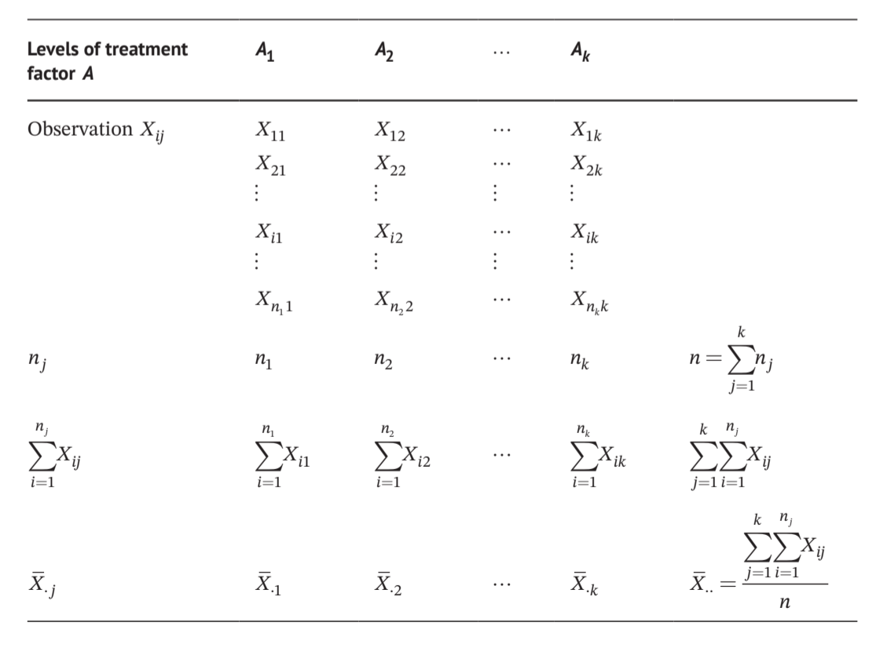
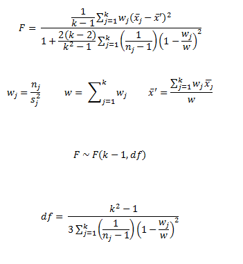

# 方差分析

## 数据来源

> 2017.临床研究中的统计分析和图形表达实例详解 第2版

## 单因素组间方差分析

### 计算公式

{fig-align="center" width="50%"}

因子A有$A_1,A_2,...,A_k$共k个水平

总变异total sum of squares

$$
SS_T=\sum_{j=1}^{k}\sum_{i=1}^{n_j}X_{ij}^2-\frac{(\sum_{j=1}^{k}\sum_{i=1}^{n_j}X_{ij})^2}{n}=SS_{组间}+SS_{组内}
$$

组间变异 between groups sum of squares $$
SS_{组间}=\sum_{j=1}^{k}\frac{(\sum_{i=1}^{n_j}X_{ij})^2}{n_j}-\frac{(\sum_{j=1}^{k}\sum_{i=1}^{n_j}X_{ij})^2}{n}
$$

自由度$\nu=n-1,\nu_{组间}=k-1,\nu_{组内}=\sum_{j=1}^{k}(n_j-1)=n-k$

Between groups mean square $MS_{组间}=\frac{SS_{组间}}{k-1}$

Within groups mean square $MS_{组内}=\frac{SS_{组内}}{n-k}$

$$H_0:\mu_1=\mu_2=...=\mu_k$$

$$
\frac{SS_T}{\sigma^2}\sim \chi^2(\nu),\nu=n-1
$$ $$
\frac{SS_{组内}}{\sigma^2}\sim \chi^2(\nu),\nu=n-k
$$ 因此，

$$
\frac{SS_{组间}}{\sigma^2}=\frac{SS_T}{\sigma^2}-\frac{SS_{组内}}{\sigma^2}\ \ \ \sim \chi^2(\nu),\nu=k-1
$$

检验统计量

$$
F=\frac{\frac{SS_{组间}}{(k-1)\sigma^2}}{\frac{SS_{组内}}{(n-k)\sigma^2}}=\frac{\frac{SS_{组间}}{k-1}}{\frac{SS_{组内}}{n-k}}=\frac{MS_{组间}}{MS_{组内}}\ \ \ \sim \chi^2(\nu),\nu=k-1
$$

```{r}
# 宽格式数据框（和原表格一致）
df_wide <- data.frame(
  normal = c(332.96, 297.64, 312.57, 295.47, 284.25, 307.97, 292.12, 244.61, 261.46, 286.46, 322.49, 282.42),
  middle = c(253.21, 235.87, 269.30, 258.90, 254.39, 200.87, 227.79, 237.05, 216.85, 238.03, 238.19, 243.49),
  high = c(232.55, 217.71, 216.15, 220.72, 219.46, 247.47, 280.75, 196.01, 208.24, 198.41, 240.35, 219.56)
)
df_long <- df_wide |> pivot_longer(cols = everything(),
                              names_to = "level",
                              values_to = "value")
```

### `stats::aov()`

```{r}

df_long$level <- factor(df_long$level)
df_aov <- aov(value~level,data = df_long)

anova(df_aov)
```

### `stats::lm()`

```{r}
lm_aov <- lm(formula = value ~  level, data = df_long)
lm_aov

anova(lm_aov)

model.matrix(~ level, data = df_long)
lm(formula = value ~ 0 + level, data = df_long)
model.matrix(~ 0 + level, data = df_long)
```

### `ez::ezANOVA()`

```{r}
df_long <- df_long |> rowid_to_column(var = "id") |> 
    relocate(id,.before = 1) |> mutate(id=factor(id))

ez::ezANOVA(data = df_long,
            dv = value,
            wid = id,
            between = level,
            type = 3,
            detailed = T)

```

## 假设

<https://www.statmethods.net/stats/rdiagnostics.html>

### **独立性，正态性**

### 方差齐性

<http://www.cookbook-r.com/Statistical_analysis/Homogeneity_of_variance/>

#### Bartlett's test

数据满足正态性

比较每一组方差的加权算术均值和几何均值。

$$
H_0:\sigma_1^2=\sigma_2^2=...=\sigma_k^2
$$ 当样本量$n_j$≥5时，检验统计量(各组样本量相等)

$$
B=\frac{(n-1)[kln\bar S^2-\sum_{j=1}^{k}lnS_j^2]}{1+\frac{k+1}{3k(n-1)}} \sim\ \chi^2(\nu)\ ,\nu=k-1
$$ 其中n是每一组的样本量，$S_j^2$是某一组的样本方差，$\bar S^2$是所有k个组样本方差的平均值。

当各组样本量不等时，

$$
B=\frac{\sum_{j=1}^{k}(n_j-1)ln\frac{\bar S^2}{S_j^2}}{1+\frac{1}{3(k-1)}(\sum_{j=1}^{k}\frac {1}{n_j-1}-\frac{1}{\sum_{j=1}^{k}(n_j-1)})} \sim\ \chi^2(\nu)\ ,\nu=k-1
$$ 其中$h_j$是某一组的样本量，$\bar S^2=(\sum_{j=1}^{k}(n_j-1)S_j^2)/(\sum_{j=1}^{k}(n_j-1))$是所有k个组样本方差的加权平均值。

```{r}
bartlett.test(value~level,data = df_long)
```

#### Levene's test

数据不满足正态性

1.  k个随机样本是独立的
2.  随机变量X是连续的

```{r}
car::leveneTest(value~level,data = df_long,center = mean)  # 同SPSS
```

Levene 变换：

$$
Z_{ij}=|X_{ij}-\bar X_{.\ j}|(i=1,2...,n_j;\ j=1,2,...,k)
$$

检验统计量（基于变换后的F检验）

$$
W=\frac{MS_{组间}}{MS_{组内}}=\frac{\sum_jn_j(\bar Z_{.j}-\bar Z_{..})^2/(k-1)}{\sum_j\sum_i(Z_{ij}-\bar Z_{.j})^2/(n-k)}  \sim F(\nu_1,\nu_2)   \ \ \ \ \nu_1=k-1,\nu_2=n-k
$$

## 事后比较（Post hoc）

成对比较的数量 $N=\frac{k!}{2!(k-2)!},k≥3$，导致犯第Ⅰ类错误的概率迅速增加，$[1-(1-\alpha)^N]$。

#### Tukey's test

Tukey's test 也被称为Tukey's honestly significant difference (Tukey's HSD) test。

1.  k个均值从大到小排列；
2.  均值最大的组依次与均值最小，第二小，......，第二大比较；
3.  均值第二大的组以同样的方式比较；
4.  以此类推
5.  在各组样本量相等的情况下，如果在两个均值之间未发现显著差异，则推断这两个均值所包含的任何均值之间不存在显著差异，并且不再检验所包含均值之间的差异。

studentized range statistic $q=\frac{\bar X_{max}-\bar X_{min}}{S_{\bar X_{max}-\bar X_{min}}}$，其中$S_{\bar X_{max}-\bar X_{min}}=\sqrt{\frac{MS_{组内}}{n}}$，$n$是每一个治疗组的样本量。

如果各组样本量不等,则$S_{\bar X_{max}-\bar X_{min}}=\sqrt{\frac{MS_{组内}}{2}(\frac{1}{n_i}+\frac{1}{n_j})}$

检验统计量

$$
HSD=q_{(k,\nu_{组内}),1-\alpha} \times S_{\bar X_{max}-\bar X_{min}},\nu_{组内}=k(n_j-1)
$$

对于任意i,j且$\bar X_i＞\bar X_j$，如果$\bar X_i-\bar X_j＞HSD$，那么拒绝$H_0$，说明这两组存在显著差异。

$$
H_0:\mu_i=\mu_j(i≠j)
$$

```{r}
posthoc_tukey <- TukeyHSD(df_aov)
posthoc_tukey


library(multcomp)
posthoc_tukey_glht <- glht(df_aov, linfct = mcp(level = "Tukey"))
summary(posthoc_tukey_glht)
```

#### LSD-t test

least significant difference t-test

挑选任意感兴趣的两组进行比较

$$
H_0:\mu_i=\mu_j(i≠j)
$$

$$
LSD-t=\frac{\bar X_i-\bar X_j}{\sqrt{MS_{组内}(\frac{1}{n_i}+\frac{1}{n_j})}} \sim t(\nu) \ ,\ \nu=\nu_{组内}=n-k,a=k
$$

```{r}
library(agricolae)
# LSD 检验
lsd_result <- LSD.test(
  df_aov,        # 方差分析模型
  "level",   # 分组变量
  p.adj = "none",  # LSD 不校正（真实 LSD 定义）
  console = TRUE   # 直接输出结果
)

# LSD 值 = 18.55 （两组均值差值 >18.55 即为显著）
# 正常钙组 与 中剂量组：字母不同（a vs b）→ 差异极显著（P<0.05）
# 正常钙组 与 高剂量组：字母不同（a vs b）→ 差异极显著（P<0.05）
# 中剂量组 与 高剂量组：字母相同（b vs b）→ 差异不显著（P>0.05）
```

#### Dunnett's test

*Dunnett's test*也称为*q'*-test,是两独立样本t-test的一种修正。Dunnett's test 假设数据符合正态分布，并且各组的方差相等。 控制对照组（C）与其他每个实验组（T）比较。

$H_0:\mu_C=\mu_T$

$$
q'=\frac{\bar X_T-\bar X_C}{\sqrt{MS_{组内}(\frac{1}{n_T}+\frac{1}{n_C})}} \sim q'(\nu,a) \ \ \nu=\nu_{组内},a=k
$$

临界值 $q'_{(a,\nu_E),1-\alpha/2}$

```{r}
library(multcomp)
dunnett_result <- glht(df_aov, linfct =mcp(level =c("middle - normal = 0", "high - normal = 0")))

# 查看 Dunnett's test 结果
summary(dunnett_result)

```

## Welch’s ANOVA Test

```{r}
welch_aov <- oneway.test(value ~ level, data = df_long,var.equal = F)
welch_aov

library(rstatix)
df_long |> welch_anova_test(value ~ level)


# 方差不齐时，两两 Welch t 检验（不合并方差，输出p值）
pairwise.t.test(
  df_long$value, 
  df_long$level, 
  p.adjust.method = "none",  # 不校正 = LSD风格
  pool.sd = FALSE            # 不使用合并方差，即两两Welch t
)
```

{fig-align="center"}

## 数据变换

当方差分析的正态性假设或方差齐性假设不为真时，通常使用(1)数据变换方法；(2)非参数检验方法 比较均值差异

### 平方根变换

当每个水平组的方差与均值成比例，尤其是样本来自泊松分布

$$
Y=\sqrt{X}
$$

当数据中有零或非常小的值时，

$$
Y=\sqrt{X+a} \ \ \ \ a=0.5或0.1 
$$

### 对数变换

当数据方差不齐且每个水平组标准差与均值成比例时

$$
Y=\log{X} \ \ \ \ base=e或10 
$$

当数据中有零或负值时，

$$
Y=\log{(X+a)} \ \ \ \ a为实数，使得X+a>0
$$

### 反正弦平方根变换

率，服从二项分布$B(n,\pi)$

$$
Y=\arcsin {\sqrt{\pi}} \ \ \ \
$$
